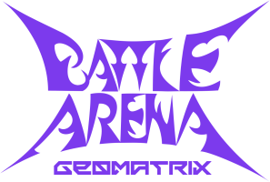

# Battle Arena Geomatrix

A 3D battle arena game developed with the **Godot 4.6** engine, featuring dynamic combat with multiple characters, weapons, and visually stunning arenas. Based off the 2001 Capcom game "Heavy Metal Geomatrix", using models and textures ripped directly from the Dreamcast assets.

## 📋 Project Information

- **Engine**: Godot 4.6
- **Type**: 3D Arena Game
- **Platform**: Cross-platform (Desktop)
- **Status**: In Development

## 🎮 Features

- **Characters**: Character system with animations and abilities
- **Weapons**: Variety of weapons with visual effects
- **Arenas**: Multiple combat scenarios
- **Particle Systems**: Advanced visual effects with GPU particles
- **Soundtrack**: Audio system with multiple tracks per level
- **Visual Effects**: Shaders, lens flares, and motion blur through addons

## 📁 Project Structure

```
heavy-metal-geomatrix-godot/
├── Scenes/           # Main game scenes
├── Scripts/          # GDScript code
├── Models/           # 3D models
├── Materials/        # Materials and shaders
├── Textures/         # Textures
├── Animations/       # Character animations
├── Music/            # Soundtrack
├── Sound/            # Sound effects
├── Fonts/            # Custom fonts
├── Prefabs/          # Reusable scenes
├── Configs/          # Configuration files
└── addons/           # Godot extensions and plugins
```

### Main Folders

- **Scripts/**: GDScript code organized by category (Characters, Weapons, UI, Physics, etc.)
- **Scenes/**: Game scenes including MainMenu, LoadingScreen, arenas, and player selection
- **Models/**: 3D models for characters, weapons, items, levels, and effects
- **Materials/**: Materials, shaders, and rendering definitions
- **Animations/**: Character animations, skeleton profiles, and libraries
- **Prefabs/**: Reusable prefabs such as Player, BotPlayer, Spawner, Particles, etc.

## 🎨 Installed Addons

The project uses various addons to enhance visual quality:

- **gputrail**: GPU trail system
- **jigglebones**: Dynamic and jiggly bones
- **shaderV**: Shader system
- **sphynx_enhanced_compositor_toolkit**: Advanced visual composition
- **sphynx_motion_blur_toolkit**: Motion blur effect
- **wigglebone**: Wiggle effects on bones
- **SIsilicon.vfx.lens flare**: Lens flare effects

## 🚀 How to Run

1. Open the project in **Godot 4.6** or higher
2. Click "Run Project" or press `F5`
3. The loading scene will be displayed and the game will start

## 🎵 Audio

The project includes:
- Soundtrack for different levels
- Sound effects (Beam, Spawn, Sword Hit, etc.)
- Audio mixing system with bus control

## 📝 Configuration

- **Precompile List**: `Configs/precompile_list.config`
- **Audio Bus Layout**: `AudioBus.tres`
- **Export Presets**: `export_presets.cfg`

## 🤝 Contributing

This is a project under development. Contributions for improvements are welcome!

## 📄 License

This project is for internal use. For more information, contact the development team.

---

**Built with ❤️ using Godot Engine**
